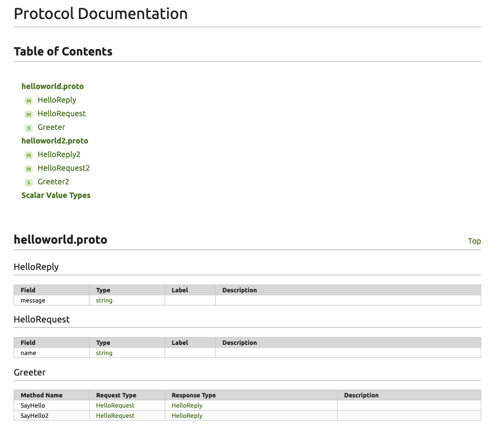

# grpc-backend-sample
grpcを使ったbackendのサンプル + protoc-gen-docを使ったAPI Documentationの自動生成

# API Documents
protoc-gen-doc
https://github.com/pseudomuto/protoc-gen-doc

## document sample image



## protoc-gen-doc　のインストール
```
$ go get -u github.com/pseudomuto/protoc-gen-doc/cmd/protoc-gen-doc
```

## Go の設定
```
# 済みであればスルー
brew install go
export GOPATH=/Users/your-user-name/.go
export PATH=$GOPATH/bin:$PATH
```

## protocol bufferからdocumentの生成
```
$ protoc \
--doc_out=./doc \
--doc_opt=html,index.html:./ ./*.proto
```

-- doc_opt=html, markdown, docbook, jsonが可能

## カスタムテンプレートの適用
参考　
https://qiita.com/ayatothos/items/ea05a70856d8812c644e

```
$ protoc \
--doc_out=./doc \
--doc_opt=custom_markdown.tmpl,index.md:./ ./*.proto
```
